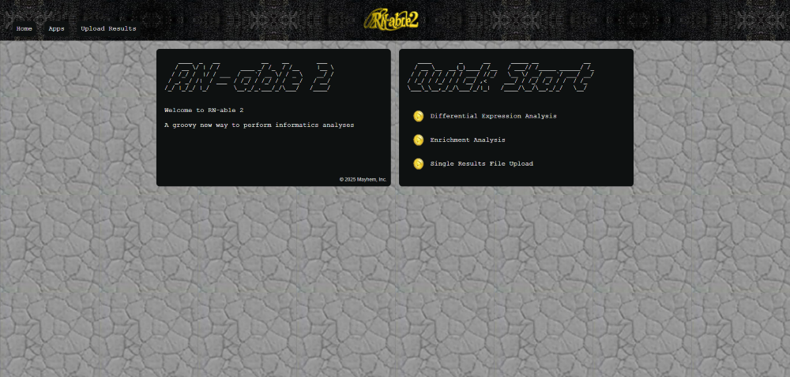
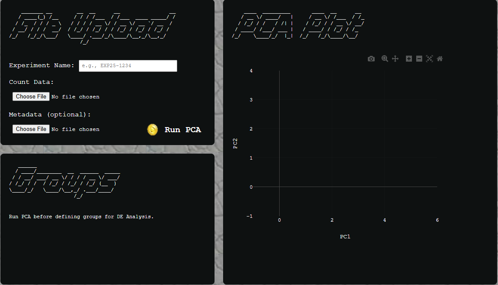
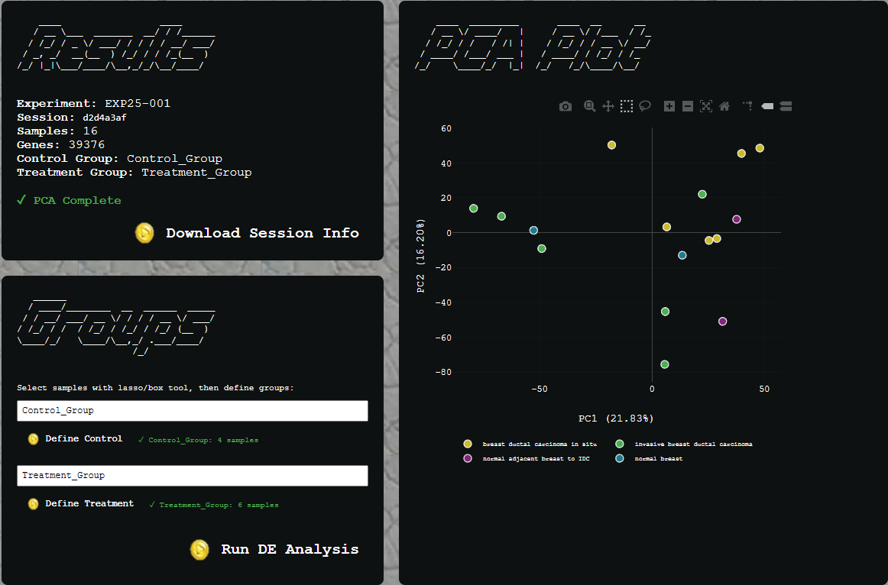

<div align="center">
    
    <h1>rn-able-2</h1>
    <p>Web application supporting informatics analyses</p>
</div>

<div align="center">


</div>

A Django based web application project supporting a variety of informatics based tools and analyses

> [!NOTE]
> The project currently only supports tools related to bulk RNA-Seq analysis.


## Table of Contents
- [Introduction](#introduction)
- [How It Works](#how-it-works)
- [Getting Started](#getting-started)
  - [Dependencies](#dependencies)
  - [Configuration](#configuration)
  - [Run](#run)
- [Todo's](#todos)

## Introduction

This project uses Plotly, DESeq2 and a Python (Django) backend to provide users with an interactive informatics analysis experience.



From the homepage, users can navigate to apps supporting Differential Expression Analysis and Enrichment Analysis, or upload existing results output files to the differential expression analysis database.

> [!NOTE]
> Currently only the DE Analysis app is fully functional. Users can upload raw count data and sample metadata, plot interactive PCA and run pairwise differential expression analysis. Metadata for a given session can be downloaded in CSV format at any time after file upload. Support for Enrichment analysis is currently limited and File Upload support does not exist.

## How It Works

### Differential Expression Analysis

When you open the app, you'll be prompted to upload two files:

1. Raw Count Matrix

- Accepted formats: `.tsv`, `.csv`, `.tsv.gz`, `.csv.gz`
- Rows represent genes
- Columns represent samples
2. Sample Metadata
- Accepted formats: `.tsv`, `.csv`, `.tsv.gz`, `.csv.gz`
- Rows represent samples
- Must include at least one column defining sample groups or conditions



**Processing Steps**

1. File Upload and PCA Computation
- Samples are parsed
- Each PCA run generates a unique analysis session
- PCA results are displayed in interactive Plotly scatter
2. Control and Treatment Group Select
- Use the Plotly box/lasso tool to highlight samples
- Label and define group
- **NOTE**: Control and treatment groups need to be defined one at a time
3. Run DE Analysis
- Once both groups have been selected you can run DE analysis

> [!NOTE]
> You can a download session metadata CSV anytime after uploading files. Once groups are defined, sample data will also be included in the report.



## Getting Started

### Dependencies

Dependencies and database generation are fully handled by running:
```bash
make setup-all
```
If you would just like to configure the environment and skip db setup you can run:
```bash
make setup-system-dependencies
```

### Configuration
Activate RN-able 2 conda environment
```bash
conda activate rnable
```

### Run
```bash
make run
```
http://127.0.0.1:8000/

## Todo's

 - Remove session.count_data = None from de_analysis views once we decide to keep raw count data for session
 - Consider swapping native filename rendering to custom to create space between choose file button and filename
 - Add custom legend to plotly that can be added as CSS variable to bottom of container, extending container. that way we can keep plot same size and have better control over more complex metadata (ie timecourse + treatment group)
 - Check metadata parsing function, do i already concatenate all columns to account for all possible conditions?
 - Consider switching DESeq2 biocmanager install over to conda, currently runs slowly
 - Auth app implementation
 - Enrichment app development
